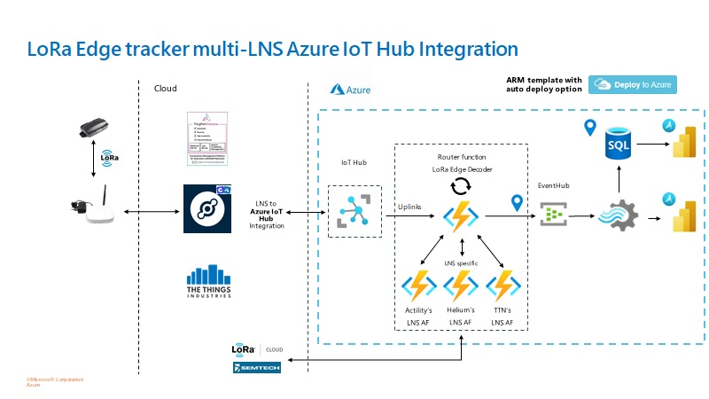

# Semtech LoRa Edge Tracker and Azure IoT Integration

The [LR1110](https://www.semtech.com/products/wireless-rf/lora-edge/lr1110trk1cks) LoRa Edge tracker is Semtech's new base design tracker technology. It is battery operated, leverages LoRa connectivity, and it doesn't require a GPS because it scans for geolocation signals such as WiFi and GNSS to compute its location in the cloud, making it very cost effective.
The payload coming from the tracker needs to be decoded, which you can do by leveraging Semtech's open source library that interacts with their LoRa Cloud geolocation service.

This project takes Semtech's decoder to the next level by integrating it with Azure IoT Hub and making it easy to deploy to your Azure subscription via an Azure Resource Manager (ARM) template and leverage Azure services to implement your business applications. Because there is code that is depedent on the LoRaWAN Network Server (LNS) implementation being used, we provide support for 3 popular LNS providers as an example: Actility, Helium, and The Things Industries. Users of this code are welcome to extend it to support additional LNS providers.

## Architecture and General Design

Here is the general architecture for this solution:


Main components:

* LNS to Azure IoT Hub integration. This is a pre-requisite, since the LNS needs to be able to interact with Azure IoT Hub for both uplinks and downlinks.
* Router Azure Function. This function is responsible for getting the tracker payload, calling the LNS specific function to prepare the package required for using the LoRa Cloud APIs to decode the payload, and passing the resulting lat/long coordinates forward.
* LNS specific Azure Function. This project supports 3 LNS providers: Actility, Helium, and The Things Industries. Users are encourage to extend it to other LNS providers.
* Event Hub + Azure Stream Analytics. These components are used for routing the incoming data once decoded to the corresponding business application (e.g., storage, Power BI).
* Power BI dashboard using Azure Maps. We provide an example of a Power BI dashboard that's consuming data directly from an Azure SQL DB and displaying the lat/long coordinates using Azure Maps.

## Getting Started

Here is what you need to do if you would like to take advantage of this project to connect your LoRa Edge tracker to Azure:

* Deploy ARM template to your Azure subscription.
* Setup configuration parameters based on your specific deployment (e.g., Event Hub connection string, LNS to be used, etc.).
* Configure your LoRaWAN gateway to connect to your desired LNS provider.
* Configure your LNS via the corresponding console to listen to your gateway/tracker and to push data to the corresponding IoT Hub.
* Reset your tracker and make sure it wasn't connected to another LNS provider (and if it was, please make sure you remove it first before trying to connect it to a new one).

### Prerequisites

- LoRaWAN gateway to connect to the desired LoRaWAN network/LNS.
- LR1110 tracker.
- Azure subscription.

### Setup Guide

This is a step by step guide to setup the infrastructure an deploy the code to ingest, compute and visualise the LoRa Edge tracker data.

For now the process is semi-automated. Certain steps need to be done manually.

### Setup Prerequisites

The following tools and extension are necessary to build and deploy the sources and projects.
Please make sure to have the prerequisites ready before starting the setup.

* [Visual Studio Code](https://code.visualstudio.com/)
* [Visual Studio Code Azure Functions Extension](https://marketplace.visualstudio.com/items?itemName=ms-azuretools.vscode-azurefunctions)
* [Visual Studio Code SQL Extension](https://marketplace.visualstudio.com/items?itemName=ms-mssql.mssql)
* [Visual Studio Code Stream Analytics Extension](https://marketplace.visualstudio.com/items?itemName=ms-bigdatatools.vscode-asa)
* [Visual Studio Code Python Extension](https://marketplace.visualstudio.com/items?itemName=ms-python.python)
* [Visual Studio Code C# Extension](https://marketplace.visualstudio.com/items?itemName=ms-dotnettools.csharp)
* [Azure Functions Core Tools](https://docs.microsoft.com/en-us/azure/azure-functions/functions-run-local?tabs=v4%2Cwindows%2Ccsharp%2Cportal%2Cbash)
* [\.NET 6.0 SDK](https://dotnet.microsoft.com/en-us/download/dotnet/thank-you/sdk-6.0.201-windows-x64-installer)
* [Python Version 3.9 or higher](https://www.python.org/downloads/) 

### Deployment of the Azure services

The following button deploys the core infrastructure into your chosen subscription.

[](https://portal.azure.com/#create/Microsoft.Template/uri/https%3A%2F%2Fraw.githubusercontent.com%2Fyaens%2Farm-templates%2Fmaster%2Farm-test%2FazuredeployBasic.json)

For the custom deployment, the following parameters need to be defined:
- Region: Select your designated Azure Region, make sure to pick a region which supports the necessary components
- Unique Solution Prefix: Pick a unique string for your solution, please use numbers and lower case characters only
- Sql Administrator Login: pick an username for your SQL administrator
- Sql Administrator Login Password: define a strong password for your SQL administrator. It has to include small letters, capital letters, a number and a special character
- Sql Firewall Start IP: Add the public IP of your computer to this field, for testing purposes you can use ```1.1.1.1```
- Sql Firewall End IP: Add the public IP of your computer to this field, for testing purposes you can use ```255.255.255.255```

The template includes the following components
- IoT Hub
- Azure Function
- SQL DB
- EventHub
- StreamAnalytics

If you would like to deploy the ARM template manually you can find the code in the ```/arm``` directory.

### Source code deployment

This chapter describes how to deploy the source code into the created Azure components in step before.

Before starting with the deployment, please make sure that the Azure services have been deployed and the necessary tool prerequisites have been installed on your local machine.

Clone this github repository to your local computer:

```git clone https://github.com/Azure-Samples/semtech-lr1110-azureiot-integration```

### Azure SQL DB Deployment

1. Open the ```SensorDataSQLDB``` Project with Visual Studio Code
2. Make sure to establish the connection to the previously created DB with the Visual Studio Code SQL extension
3. Open the ```signal_position.sql``` file in the project folder
4. Click the execture button in the top right corner and make sure to pick the previously created connection
5. The query should be successfully executed

### Azure Stream Analytics deployment

1. Open the ```DataPipelineASA``` Projekt with Visual Studio Code
2. The Azure Stream Analytics Visual Code extension should recognize the project
3. Open the ```decoder-input.json``` file in the Inputs folder
4. Use the Azure Stream Analytics extension and the offered wizard to add the previously created Azure EventHub as input
5. Open the ```output.json`` file in the Outputs folder
6. Use the Azure Stream Analytics extension and the offered wizard to add the previously created Azure SQLDB as output
    1. Make sure to use the same User and Password as defined in the deployment
    2. Use the wizard to set the password in the file to store it in the secure configuration manager
    3. The SQL output table has the name ```signal_position```
7. Open the file ```loraedge-ASA.asaql``` and use the Visual Studio Code Command Palette (Ctrl-Shift-P) to run the following command: ```ASA: Submit to Azure```
8. Follow the wizard to deploy your Job to the previously deployed ASA instance on Azure

### Router Function deployment

1. Open the ```Router``` project with Visual Studio Code
2. The C# Visual Studio Code Extension should recognize the project
3. Use the Visual Studio Code Command Palette (Ctrl-Shift-P) to run the following command: ```Azure Functions: Deploy to Function App...```
4. Follow the wizard and make sure to pick the function app ending with ```-csharp```
5. The function should know be automatically built and deployed to Azure

### Decoder Function deployment

The Decoder function is used to transform the LoRa Uplink messages into usable and computable sensor information. The decoding function is depended on the LoRaWAN Networkserver where your LoRa Edge tracker is connected and is integrated with your Azure IoT Hub. At the moment the following vendors are supported:
- Actility Thinkpark
- The Things Network/The Things Industries
- Helium Console

Depending on the LNS of your choice, open one of the following projects with Visual Studio Code:
- ```ActilityLoRaEdgeDecoder```
- ```HeliumLoRaEdgeDecoder```
- ```TTNLoRaEdgeDecoder```

1. The C# Visual Studio Code Extension should recognize the project
2. Use the Visual Studio Code Command Palette (Ctrl-Shift-P) to run the following command: ```Azure Functions: Deploy to Function App...```
3. Follow the wizard and make sure to pick the function app ending with ```-python```
4. The function should know be automatically built and deployed to Azure

### Configuration of the Router Function: Environment variables

The Router function application uses a collection of environment variables. This section contains a description and example of each variable.

#### EVENT_HUB_ROUTER_INPUT

The connection string of the IoT Hub's Event Hub, used as trigger on the *Router* Function to send the messages to the appropriate decoders.

```
Endpoint=sb://something.servicebus.windows.net/;SharedAccessKeyName=iothubowner;SharedAccessKey=xx;EntityPath=iothubname;
SharedAccessKeyName=iothubowner
```

#### EVENT_HUB_ROUTER_OUTPUT

Connection string defining the output of the router function to the enriched and decoded message Event Hub.

```
Endpoint=sb://something.servicebus.windows.net/;SharedAccessKeyName=RootManageSharedAccessKey;SharedAccessKey=xx
```

#### IOT_HUB_OWNER_CONNECTION_STRING

The connection string for the IoT Hub used for device syncing and reading the device registry.

```
HostName=something.azure-devices.net;SharedAccessKeyName=iothubowner;SharedAccessKey=xx
```

#### DECODER_URL

The Router function only supports a single decoder for moment. This configuration is the Azure Function URL of the deployed decoder Function. The URL can be found in the deployed Decoder function under ```Code + Test``` and ```Get function URL```
```
https://{yourfunctionname}.azurewebsites.net/api/LoRaEdgeDecoderHelium
```
### Configuration of the Decoder Function: Environment variables

The Decoder function application uses a collection of environment variables. This section contains a description and example of each variable.

#### dasLoRaCloudURI

URL of the Semtech LoRa Cloud to compute the LoRa Edge positioning fix.

```
https://das.loracloud.com/api/v1/device/send
```

#### dasAuthToken

Authentication Token for the Semtech LoRa Cloud. Tokens can be generated in the [Semtech Portal](https://www.loracloud.com/portal/modem_services/tokens).

```
AQEAxxxxxHvset0OS9ZidYRgpSlYrd12NDvqxxxxxDVIGQAi+WFF
```

#### iotHubConnectionString

The connection string for the IoT Hub used for sending downlinks to the LoRa devices 

```
HostName=something.azure-devices.net;SharedAccessKeyName=iothubowner;SharedAccessKey=xx
```
 
## Visualizing geolocation data using Power BI

An example of how to create a Power BI report to visualize the data generated by the tracker is included [here](docs/powerbi_report.md).

## Resources

- [LR1110](https://www.semtech.com/products/wireless-rf/lora-edge/lr1110trk1cks) documentation.
- [Dragino LPS8](https://www.dragino.com/products/lora-lorawan-gateway/item/148-lps8.html) gateway documentation.
- [Actility and Azure IoT Hub integration](https://docs.thingpark.com/thingpark-x/latest/Connector/AZURE/#creating-an-iot-hub) documentation.
- [Actlity and Azure IoT Hub integration](https://www.youtube.com/watch?v=J2ecr2rQq8Y) IoT Show episode.
- [Helium and Azure IoT Hub integration](https://docs.helium.com/use-the-network/console/integrations/azure/).
- [Helium Hacks episode - Azure IoT Hub integration](https://www.youtube.com/watch?v=pjPHVTFkbug).
- [The Things Industries and Azure IoT Hub integration](https://www.thethingsindustries.com/docs/integrations/cloud-integrations/azure-iot-hub/#:~:text=%20The%20key%20features%20of%20the%20Azure%20IoT,on%20the%20decoded%20payloads%2C%20and%20schedule...%20More%20).
