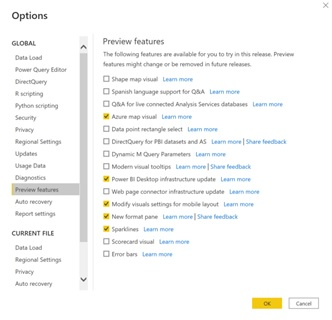
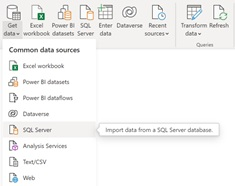
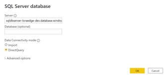
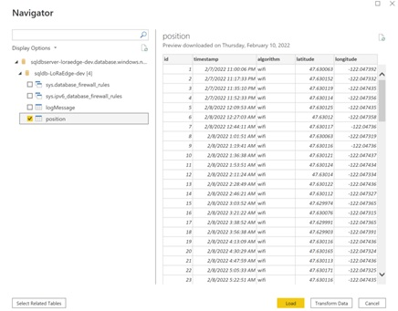
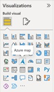
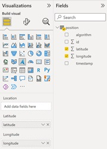
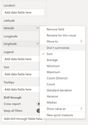
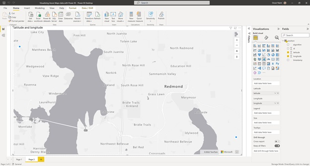

# Visualizing Geolocation data using Power BI and Azure Maps

The purpose of this document is to provide an example of how to create a Power BI report to visualize geolocation data using Azure Maps.

## Pre-requisites

Prior to creating a Power BI report for visualizing your geolocation data, you need to make sure that you have been able to gather at least a few data points in your Azure SQL database after deploying our Azure Sample solution for onboarding Semtech’s LoRa Edge tracker.
The instructions below assume that you have already deployed this solution and that you have lat/long coordinates already stored in the database.

## Instructions

- Start Power BI Desktop application. If you don’t have it, please download it from [here](https://powerbi.microsoft.com/desktop?WT.mc_id=Blog_Desktop_Update).

- Go to “File > Options and settings > Options”, select “Preview Features” and make sure that “Azure map visual” is selected.

- Select “Get data > SQL Server” to import data from corresponding Azure SQL database.

- On the Azure portal, copy the “server name” of the SQL server. 
- In the Power BI Desktop application, input the SQL Server database information and make sure to select “DirectQuery”.

- Select the “position” table within the database and click “Load”.

- On the Power BI Desktop application, go to the “Visualizations” section and drag the “Azure Maps” tile to the canvas to create your new report.

- On the “Fields” section, select your “position” table and map latitude and longitude to the corresponding fields in the visualization.

- On the “Visualizations” tab, click on “latitude” and select “don’t summarize”, and then do the same for “longitude”.

- You should now be able to see your data on the map!

